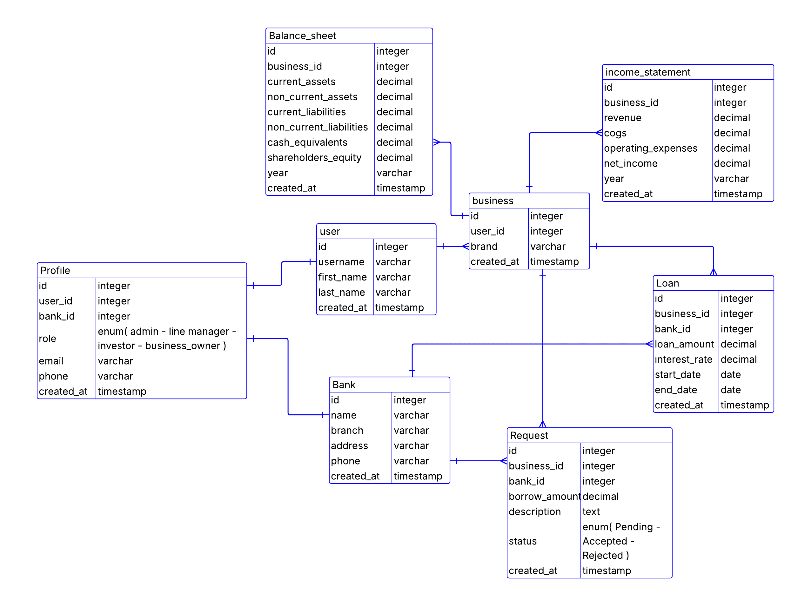
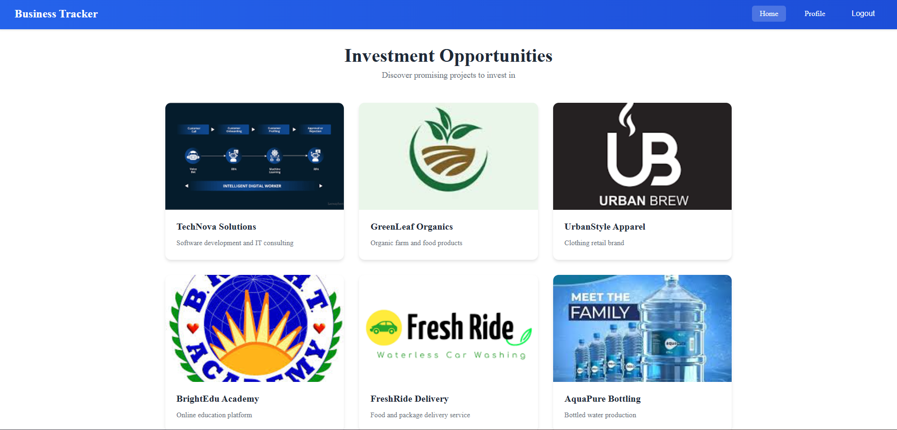
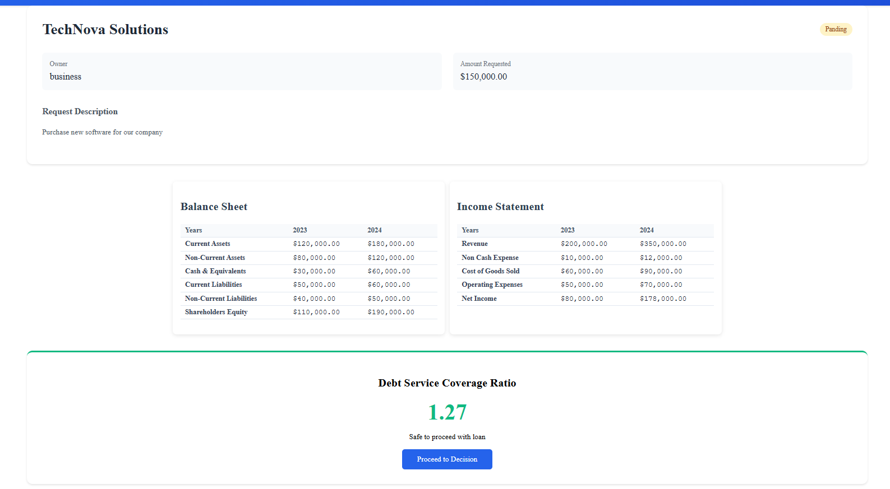
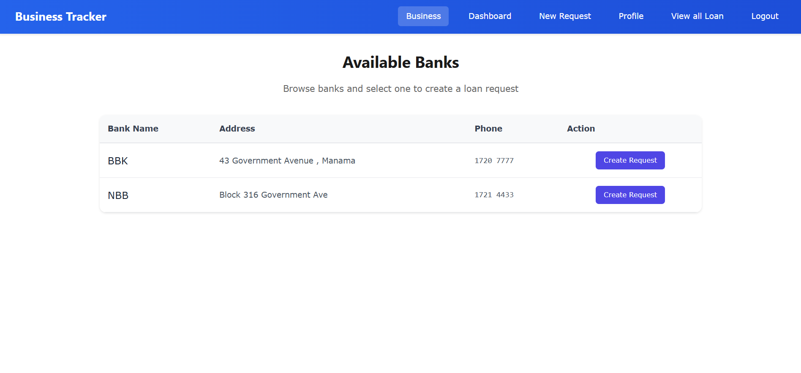
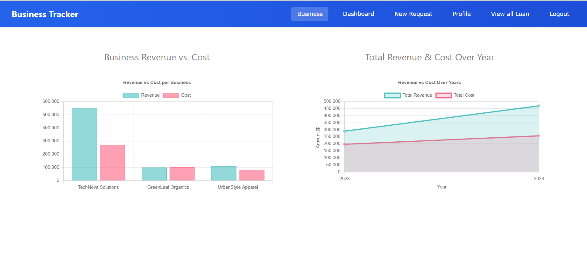

# Business-Tracker

## 📜 Project Description

It is a comprehensive digital platform designed for new entrepreneurs. It addresses the critical challenge of navigating early-stage business uncertainty by providing essential analytical tools and financial insights. The platform's core function is to help business owners determine if their venture is on a sustainable growth path. It does this by analyzing key financial metrics—like the Debt Service Coverage Ratio (DSCR) that banks use—to assess health and repayment capacity. Beyond analysis, it offers guidance on necessary pivots or the difficult decision to close, thereby saving valuable time and resources.

## Date 8/24/2025

# 🔗 Connect With Us

- 👤 **Name:** Mahmood Ali
- 💼 [LinkedIn](https://www.linkedin.com/in/mahmood-abdulnabi/)
- 🐙 [GitHub](https://github.com/Ham33d-754)

---

- 👤 **Name:** Abdulla Zaid
- 💼 [LinkedIn](https://www.linkedin.com/in/abdulla-zaid/)
- 🐙 [GitHub](https://github.com/Abdulla-Zaid11:16)

---

- 👤 **Name:** Zeshan Ahmed
- 💼 [LinkedIn](https://www.linkedin.com/in/zeshan-ahmed-bh/)
- 🐙 [GitHub](https://github.com/zeshan2001)

---

- 👤 **Name:** Ali Hasan
- 💼 [LinkedIn](https://www.linkedin.com/in/ali-khalaf-41b384333/)
- 🐙 [GitHub](https://github.com/oklyz11:16https://github.com/oklyz)

---

## 🚀 Getting Started

## 🔗 Live Site:

👉 [Deployed Project Link](https://businesstracker-d7c267641cc1.herokuapp.com/)

---

## 🧩 Project Board:

📌 [Trello Board](https://trello.com/b/zWDk9n4L/track-your-business)

---

## Example of Accounts

| Role           | Username | Password    |
| -------------- | -------- | ----------- |
| Admin          | admin    | Password123 |
| Line Manager   | manager  | Password123 |
| Business Owner | Owner    | Password123 |
| Investor       | Investor | Password123 |

## Wireframes Design

## ERD Design

## Screenshot Design

## 🔮 Future Work

- Add a cash flow statement.
- When the loan is accepted, the business owner will receive the money.
- Add a unique colour theme for each user type.
- Add a connection method between the investor & the business owner in the platform.
- Add a balance sheet & income statement for the investor.
- Ask the bank to provide a certificate as a requirement to be added to the website. 

---

## 🛠️ Technologies Used

| Technology        | Purpose                   |
| ----------------- | ------------------------- |
| Trello            | Task & Project Management |
| Django            | Frontend & Backend        |
| Postgre           | Database                  |
| CSS               | Styling                   |

---

# 🙌 Credits

- [numpy finace library](https://numpy.org/numpy-financial/)
- [huminize jango library](https://docs.djangoproject.com/en/5.2/ref/contrib/humanize/)
- [chart.js](https://www.chartjs.org/)
