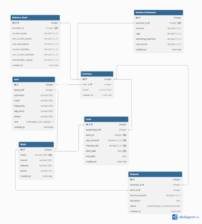

# Business-Tracker

# Date 8/24/2025

# By: Abdulla Zaid, Mahmood Ali, Zeshan Ahmed, Ali Hasan

# A brief Description of Project

It is a comprehensive digital platform designed for new entrepreneurs. It addresses the critical challenge of navigating early-stage business uncertainty by providing essential analytical tools and financial insights. The platform's core function is to help business owners determine if their venture is on a sustainable growth path. It does this by analyzing key financial metrics—like the Debt Service Coverage Ratio (DSCR) that banks use—to assess health and repayment capacity. Beyond analysis, it offers guidance on necessary pivots or the difficult decision to close, thereby saving valuable time and resources.

# Getting Started

# Wireframes Design

# ERD Design

# RESTful Table

# Screenshot Design

# Future work

-

# Lists/Tech used

- h

# source /reference/attributions

- 
- 
- 
